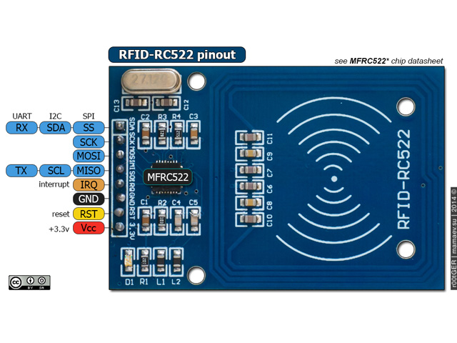

# Use Multiple Devices On SPI Bus

## Background

Another IoT work, for the Chinese middle school competition cheating.

One parking lot model with automatic checking in and out.

Use MF RC522 chips, based on SPI bus.

Use open-source library [RFID]https://github.com/miguelbalboa/rfid.

## Hardware

Arduino Mega 2560

MF RC522

## Set up

To learn about the 

RC522 SS(SDA) ----> Mega 