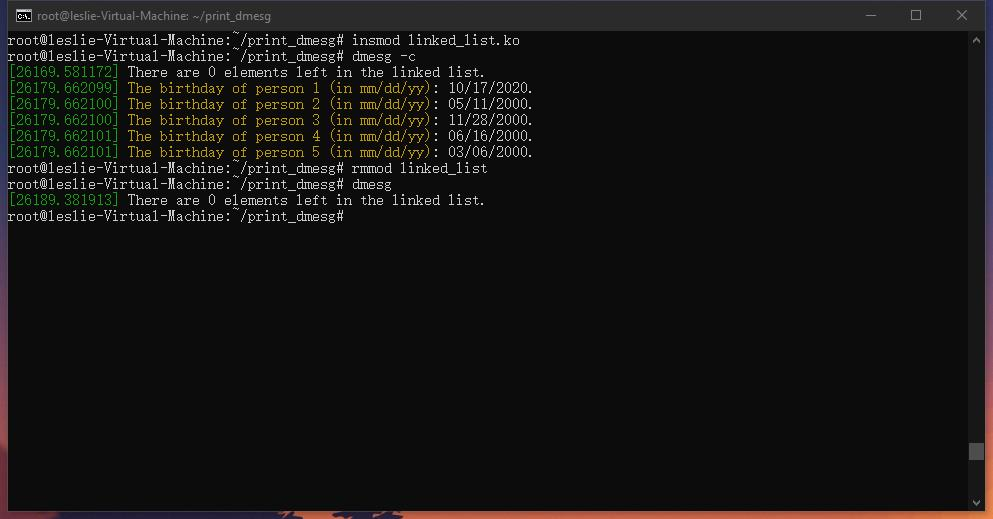

# Linux Kernel Module Test

## Background

Book ***Operating System Concepts(9th)*** by Abraham Silberschatz, page 96.

OS course project.

## Prepare

Install Ubuntu 20.04.

Connect to Ubuntu through ssh tool.

Get root privilege through command `sudo -i` .


## Create and Compile

Create a editable file in `/root/print_dmesg` directory through command `nano simple.c` .

Then put the following codes and save it.

```c
//simple.c
#include <linux/init.h>
#include <linux/kernel.h>
#include <linux/module.h>
/* This function is called when the module is loaded. */
int simple_init(void)
{
printk(KERN_INFO "Loading Module\n");
return 0;
}
/* This function is called when the module is removed. */
void simple_exit(void)
{
printk(KERN_INFO "Removing Module\n");
}
/* Macros for registering module entry and exit points. */
module_init(simple_init);
module_exit(simple_exit);
MODULE_LICENSE("GPL");
MODULE_DESCRIPTION("Simple Module");
MODULE_AUTHOR("SGG");
```

Create a editable file in `/root/print_dmesg` directory through command `nano Makefile` .

Then put the following codes and save it.

```
obj-m :=print_dmesg.o
print_dmesg-objs:=simple.o
KDIR :=/lib/modules/$(shell uname -r)/build
PWD :=$(shell pwd)
default:
	make -C $(KDIR) M=$(PWD) modules
clean:
	make -C $(KDIR) M=$(PWD) clean
```

Compile `.c` into `.ko` (Linux kernel module) through command `make` .


## Load and Remove

Load: `insmod ModuleName.ko`

Remove: `rmmod ModuleName.ko`

Show kernel log buffer: `dmesg`


## Data Structure -- Linked List

### Attention

According to ISO C90 or something, **all variables** should be **global**.

### Additional libraries, functions, fields, structures, and macros

*linux/slab.h*

`kmalloc()` Similar with malloc(), used to allocate a kernel memory space.

`kfree()` Release the memory space.

*linux/gfp.h*

`GFP_KERNEL` Flag. Means kernel method or something.

*linux/type.h*

`list_head` Structure. Linked list head.

*linux/list.h*

`INIT_LIST_HEAD()` Initialize the linked list head.

`list_add_tail()` Link the latter to the former.

`list_del()` Clear a linked list head.

`list_for_each_entry()` Macro. Traverse the linked list.

`list_for_each_entry_safe` Macro. One additional argument.

### Code and compile

Modify `simple.c` as the following.

```c
//simple.c
#include <linux/gfp.h>
#include <linux/init.h>
#include <linux/kernel.h>
#include <linux/list.h>
#include <linux/module.h>
#include <linux/slab.h>
#include <linux/types.h>

struct birthday {
	int day;
	int month;
	int year;
	struct list_head list;
};

static LIST_HEAD(birthday_list);
struct birthday *liusiyuan;
struct birthday *hexiaolu;
struct birthday *wangweiwei;
struct birthday *liaoxiaoyao;
struct birthday *someone;
struct birthday *ptr;
struct birthday *next;

int count;

/* This function is called when the module is loaded. */
int simple_init(void)
{
	liusiyuan = kmalloc(sizeof(*liusiyuan), GFP_KERNEL);
	liusiyuan->day = 6;
	liusiyuan->month= 3;
	liusiyuan->year = 2000;
	INIT_LIST_HEAD(&liusiyuan->list);
	list_add_tail(&liusiyuan->list, &birthday_list);

	hexiaolu = kmalloc(sizeof(*hexiaolu), GFP_KERNEL);
	hexiaolu->day = 16;
	hexiaolu->month= 6;
	hexiaolu->year = 2000;
	INIT_LIST_HEAD(&hexiaolu->list);
	list_add_tail(&hexiaolu->list, &liusiyuan->list);

	wangweiwei = kmalloc(sizeof(*wangweiwei), GFP_KERNEL);
	wangweiwei->day = 28;
	wangweiwei->month= 11;
	wangweiwei->year = 2000;
	INIT_LIST_HEAD(&wangweiwei->list);
	list_add_tail(&wangweiwei->list, &hexiaolu->list);

	liaoxiaoyao = kmalloc(sizeof(*liaoxiaoyao), GFP_KERNEL);
	liaoxiaoyao->day = 11;
	liaoxiaoyao->month= 5;
	liaoxiaoyao->year = 2000;
	INIT_LIST_HEAD(&liaoxiaoyao->list);
	list_add_tail(&liaoxiaoyao->list, &wangweiwei->list);

	someone = kmalloc(sizeof(*someone), GFP_KERNEL);
	someone->day = 17;
	someone->month= 10;
	someone->year = 2020;
	INIT_LIST_HEAD(&someone->list);
	list_add_tail(&someone->list, &liaoxiaoyao->list);

	count=0;
	list_for_each_entry(ptr, &birthday_list, list) {
		/* on each iteration ptr points */
		/* to the next birthday struct */
        count+=1;
        printk(KERN_INFO "The birthday of person %d (in mm/dd/yy): %02d/%02d/%02d.\n", count, ptr->month, ptr->day, ptr->year);
	}

	return 0;
}
/* This function is called when the module is removed. */
void simple_exit(void)
{
	list_for_each_entry_safe(ptr,next,&birthday_list,list) {
		/* on each iteration ptr points */
		/* to the next birthday struct */
		list_del(&ptr->list);
		kfree(ptr);
	}
	count=0;
	list_for_each_entry(ptr, &birthday_list, list) {
		/* on each iteration ptr points */
		/* to the next birthday struct */
		count+=1;
	}
	printk(KERN_INFO "There are %d elements left in the linked list.\n", count);
}
/* Macros for registering module entry and exit points. */
module_init(simple_init);
module_exit(simple_exit);
MODULE_LICENSE("GPL");
MODULE_DESCRIPTION("Simple Module");
MODULE_AUTHOR("SGG");
```

Then compile it into module.

### Result

Load and remove the module.

See the kernel log info.

